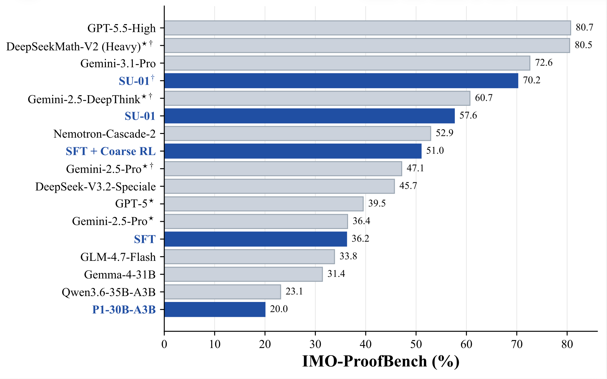

<div align="center">

<h1 style="display: flex; justify-content: center; align-items: center; gap: 10px; margin: 0;">
  SU-01: Achieving Gold-Medal-Level Olympiad Reasoning via Simple and Unified Scaling
</h1>
<p align="center"><em>A compact 30B-A3B reasoning model for rigorous mathematical and scientific olympiad problem solving.</em></p>

<div align="center">
  
</div>

[](http://arxiv.org/abs/2605.13301)
[](https://simplified-reasoning.github.io/SU-01/)
[](https://github.com/Simplified-Reasoning/SU-01)
[](https://huggingface.co/Simplified-Reasoning/SU-01)

</div>

<div align="center" style="font-family: Arial, sans-serif;">
  <p>
    <a href="#news" style="text-decoration: none; font-weight: bold;">📢 News</a> •
    <a href="#introduction" style="text-decoration: none; font-weight: bold;">📖 Introduction</a> •
    <a href="#key-highlights" style="text-decoration: none; font-weight: bold;">🏆 Key Highlights</a> •
    <a href="#released-model" style="text-decoration: none; font-weight: bold;">🤗 Released Model</a>
  </p>
  <p>
    <a href="#getting-started" style="text-decoration: none; font-weight: bold;">🚀 Getting Started</a> •
    <a href="#training-code" style="text-decoration: none; font-weight: bold;">🔧 Training Code</a> •
    <a href="#test-time-scaling" style="text-decoration: none; font-weight: bold;">🧪 Test-Time Scaling</a> •
    <a href="#evaluation" style="text-decoration: none; font-weight: bold;">📊 Evaluation</a>
  </p>
  <p>
    <a href="#acknowledgement" style="text-decoration: none; font-weight: bold;">✨ Acknowledgement</a> •
    <a href="#citation" style="text-decoration: none; font-weight: bold;">📝 Citation</a>
  </p>
</div>

---

<a id="news"></a>
# 📢 News

- **[2026/05/14]** Technical report is available at [arxiv](http://arxiv.org/abs/2605.13301).
- **[2026/05/13]** Project page is available at [https://simplified-reasoning.github.io/SU-01/](https://simplified-reasoning.github.io/SU-01/).
- **[2026/05/13]** SU-01 model weights are available on [Hugging Face](https://huggingface.co/Simplified-Reasoning/SU-01).

---

<a id="introduction"></a>
# 📖 Introduction

**SU-01** is a 30B-A3B olympiad reasoning model trained with a simple and unified post-training recipe for mathematical and scientific problem solving. The goal is to turn a broadly capable post-trained reasoning backbone into a rigorous long-horizon proof solver without relying on external tools, code execution, or dedicated symbolic solvers.

The recipe first applies **reverse-perplexity curriculum SFT** on roughly **338K sub-8K-token** trajectories to install explicit, proof-oriented reasoning behavior. It then uses **200 steps of two-stage reinforcement learning** to improve both answer-seeking ability and complete-proof quality. Finally, SU-01 uses a multi-round **generate-verify-revise** loop at inference time, enabling coherent natural-language reasoning trajectories beyond **100K tokens** on difficult olympiad problems.

In competition-style evaluations, test-time scaling brings SU-01 to **35 points on IMO 2025** and **35 points on USAMO 2026**, reaching gold-medal-level performance. SU-01 also exceeds the gold cutoff on **IPhO 2024/2025** and substantially improves over similarly sized models on proof-level benchmarks such as **IMO-ProofBench**.

---

<a id="key-highlights"></a>
# 🏆 Key Highlights

- **Reverse-perplexity curriculum SFT**: sorts long-CoT training examples by descending PPL within each epoch, exposing the model first to teacher trajectories most mismatched with the current policy.
- **Two-stage RL**: starts with verifiable-reward training for answer-seeking behavior, then shifts to proof-quality optimization with self-refinement and experience replay.
- **Long-horizon proof repair**: uses iterative generation, verification, issue localization, and refinement to produce complete olympiad-style solutions.
- **Gold-medal-level results**: reaches 35 points on both IMO 2025 and USAMO 2026 with test-time scaling, and passes IPhO 2024/2025 gold lines.

<div align="center">
  
</div>

## Gold-Medal Competition Results

### IMO 2025

| **Model** | **P1** | **P2** | **P3** | **P4** | **P5** | **P6** | **Total** |
|-----------|-------:|-------:|-------:|-------:|-------:|-------:|----------:|
| SU-01 | 1 | 7 | 1 | 6 | 6 | 0 | 21 |
| **SU-01 w/ TTS** | **7**<sup>*</sup> | **7**<sup>*</sup> | **7**<sup>*</sup> | **7**<sup>*</sup> | **7**<sup>*</sup> | **0**<sup>*</sup> | **35**<sup>*</sup> 🥇 |

### USAMO 2026

| **Model** | **P1** | **P2** | **P3** | **P4** | **P5** | **P6** | **Total** |
|-----------|-------:|-------:|-------:|-------:|-------:|-------:|----------:|
| SU-01 | 7 | 0 | 0 | 7 | 0 | 1 | 15 |
| **SU-01 w/ TTS** | **7**<sup>*</sup> | **0**<sup>*</sup> | **7**<sup>*</sup> | **7**<sup>*</sup> | **7**<sup>*</sup> | **7**<sup>*</sup> | **35**<sup>*</sup> 🥇 |

`*` denotes results graded by human experts. Medal lines for IMO 2025 are 35/28/19 points for gold/silver/bronze, and medal lines for USAMO 2026 are 25/18/11 points.

---

<a id="released-model"></a>
# 🤗 Released Model

| **Model** | **Hugging Face** | **Base / Backbone** | **Notes** |
|-----------|-------------------|----------------------|-----------|
| SU-01 | [Simplified-Reasoning/SU-01](https://huggingface.co/Simplified-Reasoning/SU-01) | P1-30B-A3B backbone | Final SU-01 release model trained with SFT, coarse RL, refined RL, and evaluated with optional TTS. |

---

<a id="getting-started"></a>
# 🚀 Getting Started

## Installation

We use the slime Docker image [slimerl/slime:nightly-dev-20260202c](https://hub.docker.com/layers/slimerl/slime/nightly-dev-20260202c).

```bash
docker pull slimerl/slime:nightly-dev-20260202c

docker run --gpus all --ipc=host --network=host -it \
  -v "$PWD":/workspace/SU-01 \
  -w /workspace/SU-01/su01-train-slime \
  slimerl/slime:nightly-dev-20260202c \
  /bin/bash
```

Inside the container, install the local training package:

```bash
pip install -e . --no-deps --no-index --disable-pip-version-check --no-build-isolation
```

Adjust cluster mounts, model paths, data paths, Ray environment variables, and reward-server URLs according to your infrastructure.

---

<a id="training-code"></a>
# 🔧 Training Code

The released training code contains the three major training stages used by SU-01:

```text
su01-train-slime/scripts
├── sft.sh          # Stage 1: reverse-perplexity curriculum SFT
├── coarse_rl.sh    # Stage 2: coarse RL with verifiable rewards
└── refined_rl.sh   # Stage 3: refined RL with proof rewards, self-refinement, and experience replay
```

## Stage 1: SFT

The SFT stage reshapes the backbone toward explicit, disciplined, proof-oriented long-form reasoning. It uses a filtered mixture of mathematical, scientific, instruction-following, coding, self-verification, and self-refinement trajectories. Training is implemented with slime, uses four epochs, batch size 128, Adam with learning rate `1e-5`, cosine decay to `1e-6`, and rollout shuffling disabled to preserve the curriculum order.

```bash
cd su01-train-slime
bash scripts/sft.sh
```

## Stage 2: Coarse RL

Coarse RL trains on verifiable prompts with reinforcement learning from verifiable rewards. The stage uses Group Sequence Policy Optimization (GSPO), complete-response-level reward assignment, dynamic sampling, partial rollout, trajectory importance sampling, and answer verification through a layered reward pipeline.

```bash
cd su01-train-slime
bash scripts/coarse_rl.sh
```

## Stage 3: Refined RL

Refined RL shifts optimization from final-answer correctness to proof quality. It mixes verifiable prompts, proof-reward prompts, self-refinement prompts, and replayed successful proof trajectories. The stage uses process-level proof rewards, a self-refinement ratio of `0.2`, and an experience replay ratio of `0.25`.

```bash
cd su01-train-slime
bash scripts/refined_rl.sh
```

---

<a id="test-time-scaling"></a>
# 🧪 Test-Time Scaling

SU-01 uses a model-internal verification-and-refinement loop using the method in this [repo](https://github.com/lyang36/IMO25):

1. Generate an initial complete solution.
2. Verify the full proof and produce a structured critique or bug report.
3. Refine the solution conditioned on the critique.
4. Repeat until the solution is accepted or the refinement budget is exhausted.

This expands the model's own natural-language proof-search computation rather than calling an external theorem prover, symbolic solver, or code executor. In the reported USAMO 2026 TTS traces, initial solution generations have a median length of approximately **106K tokens**, while refinement stages have a median length of approximately **83K tokens**.

The released TTS implementation is in `su01-eval/decode`, including direct decoding, TTS decoding, batch decoding, and SGLang server helpers. See [`su01-eval/decode/README.md`](su01-eval/decode/README.md) for launch commands, input layout, decoding options, and smoke tests.

<div align="center">
  
</div>

---

<a id="evaluation"></a>
# 📊 Evaluation

Evaluation code is released under `su01-eval`. Use `su01-eval/decode` to generate direct or TTS predictions, and use `su01-eval/verifiable_bench` to score answer-verifiable benchmarks and FrontierScience Olympiad predictions. See [`su01-eval/decode/README.md`](su01-eval/decode/README.md) and [`su01-eval/verifiable_bench/README.md`](su01-eval/verifiable_bench/README.md) for commands, input formats, output formats, and configuration options.

## Table 1: Performance on Answer-Verifiable Reasoning Tasks

AnswerBench, AMO-Bench, AIME 25/26, and FrontierScience-Olympiad are averaged over 4, 8, 8, and 4 runs, respectively. Avg. is the mean of AnswerBench, AMO-Bench, AIME 2025, AIME 2026, and FrontierScience-Olympiad.

| **Model** | **AnswerBench** | **AMO-Bench** | **AIME 25/26** | **FS-O Physics** | **FS-O Chemistry** | **FS-O Biology** | **FS-O Overall** | **Avg.** |
|-----------|----------------:|--------------:|---------------:|-----------------:|-------------------:|-----------------:|-----------------:|---------:|
| P1-30B-A3B | 69.3% | 41.3% | 90.4% / 89.6% | 57.5% | 57.5% | <u>27.5%</u> | 54.5% | 69.0% |
| GLM-4.7-Flash | 73.8% | 53.8% | 91.3% / 88.3% | 54.5% | 60.0% | 17.5% | 53.0% | 72.0% |
| Nemotron-Cascade-2 | **80.5%** | 40.8% | <u>94.2%</u> / 90.0% | 56.0% | 56.3% | **30.0%** | 53.5% | 71.8% |
| Qwen3.6-35B-A3B | <u>78.0%</u> | <u>58.8%</u> | 92.5% / <u>92.9%</u> | <u>65.5%</u> | **74.4%** | 25.0% | **65.0%** | **77.4%** |
| Gemma-4-31B | 74.0% | 39.3% | 88.8% / 91.3% | **69.0%** | 61.9% | <u>27.5%</u> | 61.0% | 70.9% |
| **SU-01** | 77.5% | **59.8%** | **94.6%** / **93.3%** | 62.5% | <u>69.4%</u> | 25.0% | <u>61.5%</u> | <u>77.3%</u> |

## Table 2: Performance on Non-Verifiable Benchmarks

FrontierScience-Research refers to the research subset of FrontierScience. For SU-01, `x/y` reports scores without and with TTS on IMO-ProofBench.

| **Model** | **ProofBench Basic** | **ProofBench Advanced** | **ProofBench Overall** | **FS-R Physics** | **FS-R Chemistry** | **FS-R Biology** | **FS-R Overall** |
|-----------|---------------------:|------------------------:|-----------------------:|-----------------:|-------------------:|-----------------:|-----------------:|
| Gemini 3.1 Pro Thinking | <u>95.2%</u> | <u>50.0%</u> | <u>72.6%</u> | 0.0% | <u>30.0%</u> | 10.0% | 13.3% |
| GPT-5.5-High | **96.7%** | **64.8%** | **80.7%** | **25.0%** | **40.0%** | **45.0%** | **36.7%** |
| DeepSeek-V3.2-Speciale | 77.6% | 34.3% | 56.0% | <u>10.0%</u> | 20.0% | <u>15.0%</u> | <u>15.0%</u> |
| P1-30B-A3B | 33.8% | 6.2% | 20.0% | 0.0% | **10.0%** | 0.0% | 3.3% |
| GLM-4.7-Flash | 51.0% | 16.7% | 33.8% | 0.0% | 0.0% | 0.0% | 0.0% |
| Nemotron-Cascade-2 | <u>77.1%</u> | 28.6% | 52.9% | <u>5.0%</u> | 5.0% | **20.0%** | <u>10.0%</u> |
| Qwen3.6-35B-A3B | 39.1% | 7.1% | 23.1% | 0.0% | 5.0% | 10.0% | 5.0% |
| Gemma-4-31B | 46.7% | 16.2% | 31.4% | 0.0% | **10.0%** | 5.0% | 5.0% |
| **SU-01** | <u>77.1%</u> / **91.0%** | <u>38.1%</u> / **49.5%** | <u>57.6%</u> / **70.2%** | **10.0%** | **10.0%** | <u>15.0%</u> | **11.7%** |

## Table 3: Performance on Olympiad Competition Problems

For IPhO, `x/y` reports scores without and with TTS. Gold lines for IPhO 2024/2025 are 20.8/19.7 points. Medal lines for IMO 2025 are 35/28/19 points, and medal lines for USAMO 2026 are 25/18/11 points.

### IPhO 2024/2025

| **Model** | **IPhO 2024** | **IPhO 2025** |
|-----------|--------------:|--------------:|
| P1-30B-A3B | 23.1 | 17.7 |
| GLM-4.7-Flash | 22.2 | 19.5 |
| Nemotron-Cascade-2 | 21.2 | 16.7 |
| Qwen3.6-35B-A3B | 24.3 | 19.9 |
| Gemma-4-31B | <u>24.4</u> | <u>20.3</u> |
| **SU-01** | 23.5 / **25.3** | <u>20.3</u> / **21.7** |

### IMO 2025

| **Model** | **P1** | **P2** | **P3** | **P4** | **P5** | **P6** | **Total** |
|-----------|-------:|-------:|-------:|-------:|-------:|-------:|----------:|
| SU-01 | 1 | 7 | 1 | 6 | 6 | 0 | 21 |
| **SU-01 w/ TTS** | **7**<sup>*</sup> | **7**<sup>*</sup> | **7**<sup>*</sup> | **7**<sup>*</sup> | **7**<sup>*</sup> | **0**<sup>*</sup> | **35**<sup>*</sup> 🥇 |

### USAMO 2026

| **Model** | **P1** | **P2** | **P3** | **P4** | **P5** | **P6** | **Total** |
|-----------|-------:|-------:|-------:|-------:|-------:|-------:|----------:|
| SU-01 | 7 | 0 | 0 | 7 | 0 | 1 | 15 |
| **SU-01 w/ TTS** | **7**<sup>*</sup> | **0**<sup>*</sup> | **7**<sup>*</sup> | **7**<sup>*</sup> | **7**<sup>*</sup> | **7**<sup>*</sup> | **35**<sup>*</sup> 🥇 |

`*` denotes TTS results graded by human experts.

---

<a id="acknowledgement"></a>
# ✨ Acknowledgement

This work was supported by the Shanghai Artificial Intelligence Laboratory.

We thank the authors and maintainers of prior open research and infrastructure that made this work possible. In particular, we are grateful to DeepSeek for open-sourcing strong reasoning policies and generative reward models, which provided an important reference point for our work. IMO-Bench, AMO-Bench, and FrontierScience helped guide the overall system optimization by offering challenging mathematical and scientific reasoning benchmarks and evaluation protocols.

We also thank prior data efforts that supported our SFT and RL data curation, including DeepMath, NaturalReasoning, Eurus, OpenCodeReasoning, P1, and OPC, as well as the many public problem sources and communities that cannot all be listed here. We further acknowledge the broader open-source infrastructure ecosystem, including slime for training and SGLang for efficient inference and serving.

---

<a id="citation"></a>
# 📝 Citation

If you find SU-01 useful, please cite the project:

```bibtex
@misc{su012026,
  title={Achieving Gold-Medal-Level Olympiad Reasoning via Simple and Unified Scaling},
  author={Yafu Li and Runzhe Zhan and Haoran Zhang and Shunkai Zhang and Yizhuo Li and Zhilin Wang and Jiacheng Chen and Futing Wang and Xuyang Hu and Yuchen Fan and Bangjie Xu and Yucheng Su and Xinmiao Han and Chenxi Li and Haodi Lei and Yufeng Zhao and Zejin Lin and Qianjia Cheng and Tong Zhu and Xiaoye Qu and Ganqu Cui and Peng Ye and Yun Luo and Zhouchen Lin and Yu Qiao and Bowen Zhou and Ning Ding and Yu Cheng},
  year={2026},
  url={http://arxiv.org/abs/2605.13301}
}
```
